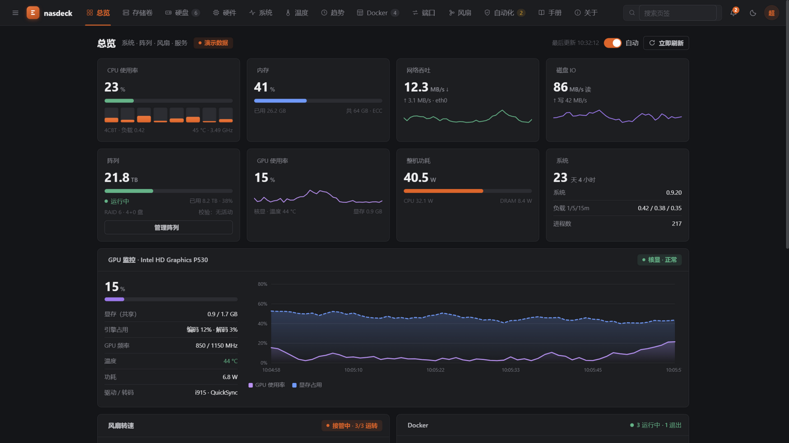
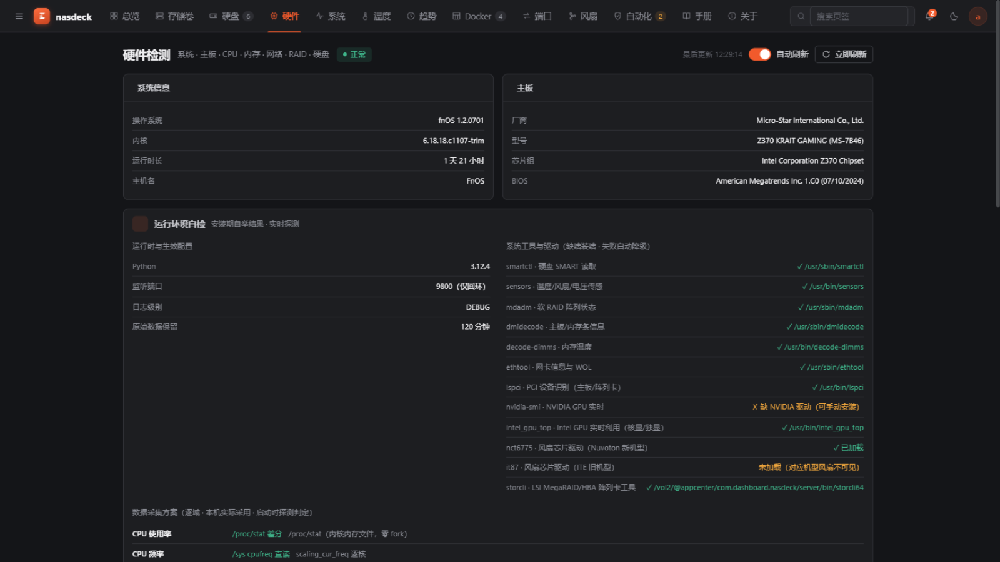
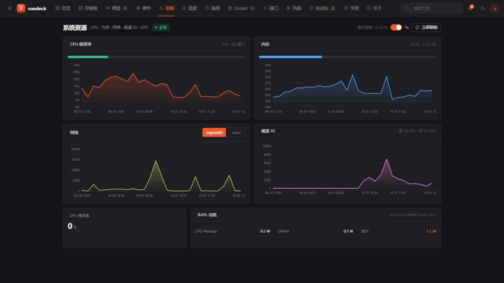
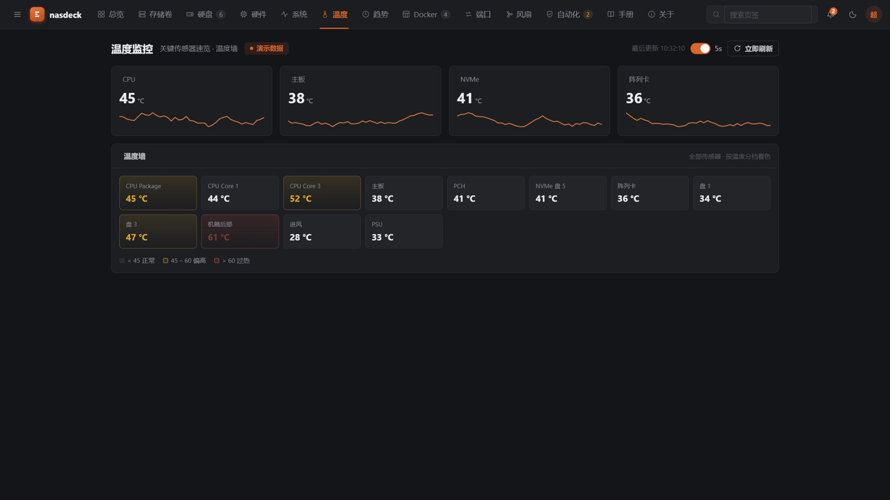
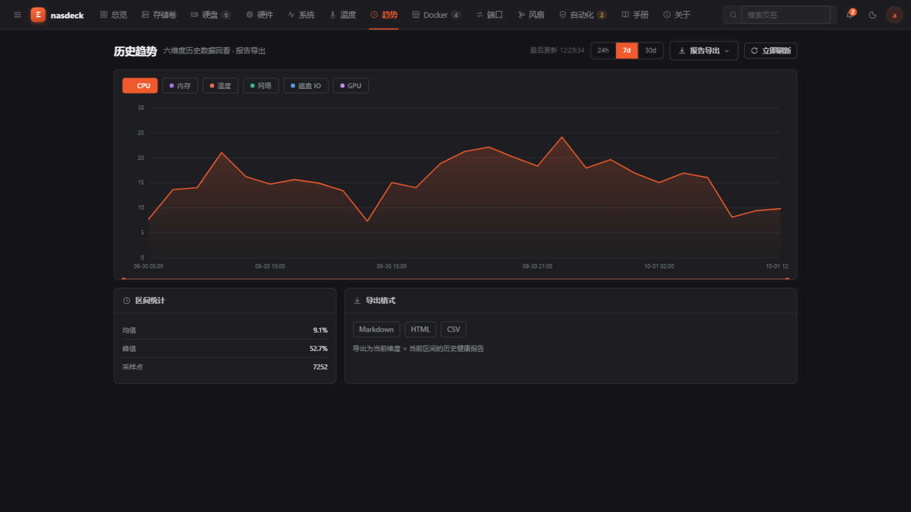
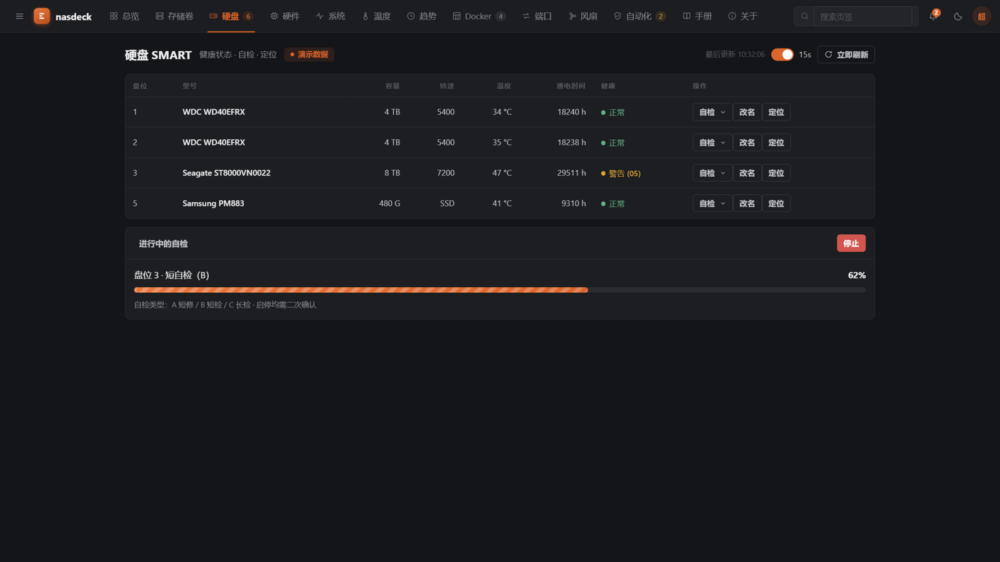
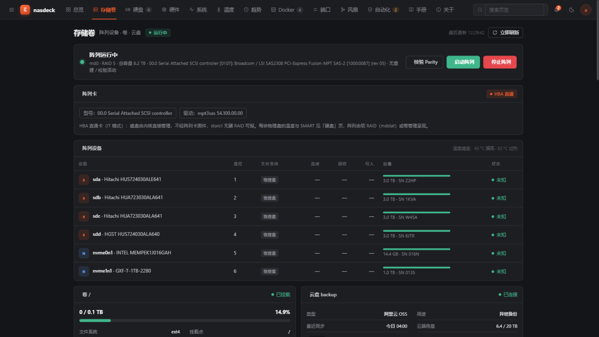
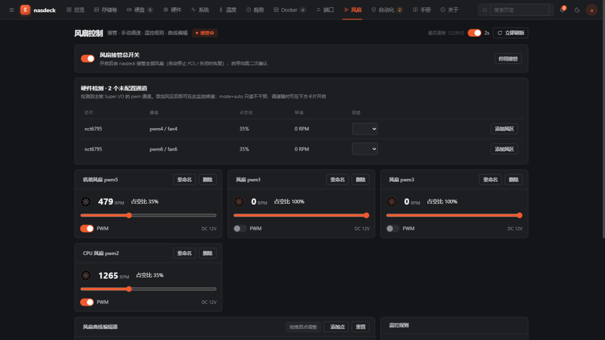
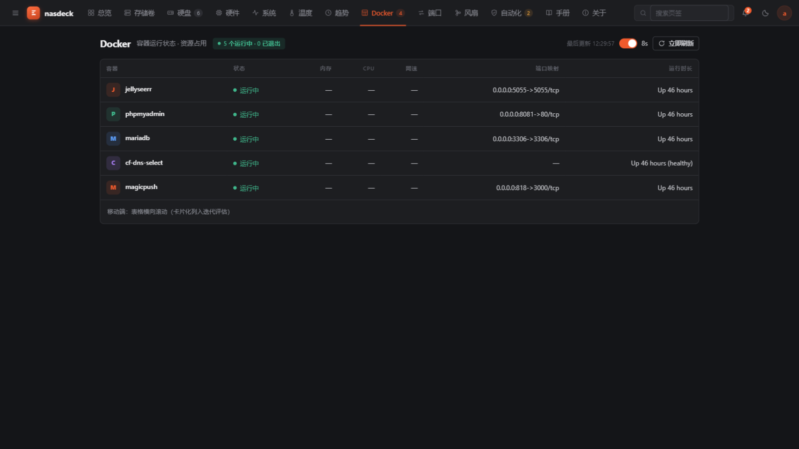
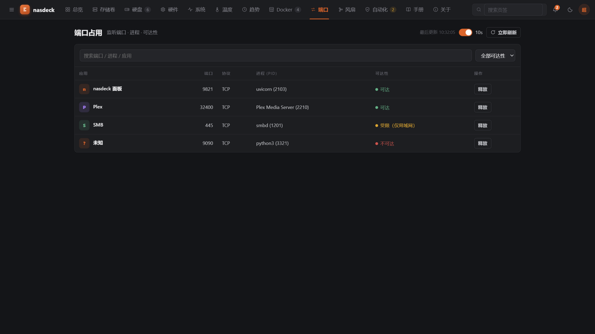

# nasdeck

**dev-0.0.26**（开发版） · 飞牛OS（fnOS）NAS 硬件监控面板

[下载 fpk](https://github.com/LarryMKott/nasdeck/releases/latest) · [操作手册](docs/使用手册.md) · [前后端接口约定](docs/前后端数据接口约定.md) · [项目 Wiki](docs/wiki/Home.md) · [FPK 打包说明](fpk/README.md) · [飞牛社区讨论帖](https://club.fnnas.com/forum.php?mod=viewthread&tid=67060)

把原本要 SSH 敲命令才能看到的硬件状态——CPU、内存、温度、风扇、硬盘 SMART、阵列卡、存储卷、Docker、端口占用——装进一块 UNRAID 风格的网页面板。FastAPI 采集、Vue 3 展示，以标准 FPK 应用包装进飞牛桌面，打开即用。

## 预览

**总览** —— 打开即看的硬件仪表盘（深色主题）：



<table>
<tr>
<td width="33%"><br><em>硬件检测（系统 / 主板 / CPU / 内存 / 网络 / RAID）</em></td>
<td width="33%"><br><em>系统资源（CPU / 内存 / 网络 / 磁盘 IO / 功耗）</em></td>
<td width="33%"><br><em>温度监控（关键传感器速览 + 温度墙）</em></td>
</tr>
<tr>
<td width="33%"><br><em>历史趋势（六维度 · 24h/7d/30d · 报告导出）</em></td>
<td width="33%"><br><em>硬盘 SMART（健康分级 · 在线自检 · 定位）</em></td>
<td width="33%"><br><em>存储卷（阵列设备 · 卷映射 · 云盘）</em></td>
</tr>
<tr>
<td width="33%"><br><em>风扇控制（接管调速 · 曲线编辑 · 温控规则）</em></td>
<td width="33%"><br><em>Docker（容器状态 · 资源占用 · 端口映射）</em></td>
<td width="33%"><br><em>端口占用（进程识别 · 可达性 · 一键释放）</em></td>
</tr>
</table>

> 截图为 fnOS 1.2.0701 真机（i3-9100T · UHD Graphics 630 核显）深色主题实拍；「控制与自动化」「操作手册」「关于」等页面见 [操作手册](docs/使用手册.md)。

## 功能

UNRAID 风格顶栏共 13 个视图（11 个功能页 + 操作手册 + 关于），覆盖 NAS 硬件运维核心场景：

- **总览**：单页仪表盘——CPU / 内存 / 网络吞吐 / 磁盘 IO / 阵列 / GPU / 整机功耗 / 风扇 / Docker 一屏尽览，秒级自动刷新
- **硬件检测**：系统信息、主板（DMI 直读品牌/BIOS/芯片组）、CPU（逐核占用）、内存（SPD 直读品牌，颗粒厂与模组厂区分）、网卡（IP/MAC/协商速率/驱动）、阵列卡自动识别 MegaRAID / HBA 直通 / 纯 SATA 三种形态，附**运行环境自检**（安装期工具/驱动自举结果实时呈现，缺失项带安装提示）
- **系统资源**：CPU / 内存 / 网络 / 磁盘 IO 60 秒滚动折线，RAPL 实时功耗（Intel），GPU 占用与频率
- **温度监控**：关键传感器速览 + 全机温度墙，按阈值分档着色，5 秒就地更新
- **历史趋势**：六维度历史回看（24h / 7d / 30d，自动降采样保留 30 天），一键导出 Markdown / HTML / CSV 健康报告
- **硬盘 SMART**：SAS / SATA / NVMe 全支持，健康分级、通电时长、真实转速，A（长自检）/ B（坏块慢扫）/ C（只读表面扫描）三档自检，盘位定位灯
- **存储卷**：mdadm RAID 状态、挂载点容量、卷映射树、云盘挂载识别
- **风扇控制**：一键接管飞牛 FCS 按温度自动调速（交还自动恢复），预设档 + 自定义「温度→PWM」曲线 + 双温控规则（硬盘温控 / 主板温控），PWM/DC 模式切换，风扇自定义命名
- **Docker**：容器状态、内存 / CPU 占用、网络速率、端口映射、运行时长
- **端口占用**：列出全部监听端口并自动识别占用者（飞牛应用 / 容器 / 系统服务），可达范围三级徽章，一键释放（保护系统关键进程）
- **控制与自动化**：温度 / SMART 告警规则，Telegram / Bark / 邮件通知渠道，一键健康报告导出
- **权限分级**：桌面入口所有用户可见，普通用户只读（界面自动隐藏设置类按钮），风扇调速 / 进程终止等写操作仅管理员（后端按飞牛身份头强制校验）

## 架构

```
飞牛桌面 iframe ──► /cgi/ThirdParty/com.dashboard.nasdeck/index.cgi（飞牛校验登录态）
                        │ 本机反代（fnpackup 同款）
                        ▼
              127.0.0.1:9800  uvicorn（FastAPI：/api/v1 七域 + WS 实时推送 + SPA 托管）
                        │ psutil / sysfs / storcli / smartctl / lsblk / lspci / docker
                        ▼
              SQLite（@appdata，raw→1m→10m 降采样，保留 30 天）
```

- **访问模型**：CGI 反代，不走统一网关——飞牛会周期性清空第三方网关入口导致 404（真机实测）；9800 仅绑回环，面板在飞牛登录态之后
- **后端**：Python 3.11+ · FastAPI + Pydantic v2 · SQLAlchemy 2.x async（aiosqlite）· APScheduler 三级采集（1s/5s/60s）· 统一信封 `{code, message, data, timestamp}` · 可选 `X-API-Key` 鉴权
- **前端**：Vue 3.4 · Vite 5 · Element Plus · Pinia · ECharts；WS 断线自动降级 HTTP 轮询
- **打包**：标准 FPK 布局，官方 fnpack 同等校验；解释器来自应用中心 `python312` 运行时，Python 依赖交叉编译为 manylinux wheels 离线随包（装机不联网、不污染系统 Python）
- **权限**：`run-as root`（SMART / storcli / PWM / systemctl 必需）；storcli 随包内置并软链到 `/usr/local/bin`

## 安装（fnOS 真机）

1. 下载 `.fpk`（Releases 或手动安装）
2. 飞牛 **应用中心 → 手动安装**，按向导确认——系统工具（smartmontools / lm-sensors / mdadm / dmidecode / i2c-tools / ethtool，Intel 显卡机型另装 intel-gpu-tools）自动安装，Python 运行环境与全部依赖离线内置，无需联网编译；监听端口默认 9800，冲突时可在向导中修改
3. 桌面出现「NAS硬件监控」图标（所有用户可见），点击打开（需登录飞牛；普通用户只读，写操作仅管理员）

> 风扇调速需要主板传感器驱动：NCT 系列系统一般自带（`modprobe nct6775`），ITE 系列装应用中心的 `ite-it87`；nasdeck 每次启动也会自动尝试加载。详见[操作手册](docs/使用手册.md)。

## 开发

```bash
# 后端（127.0.0.1:8766）
cd backend && .venv/Scripts/python.exe -m uvicorn main:app --port 8766

# 前端（127.0.0.1:5173，代理已指向 8766；内置演示数据模式，后端不在也能跑）
cd frontend && pnpm dev

# 测试（73 项）
cd backend && .venv/Scripts/python.exe -m pytest -q

# 打 FPK 包（产物 build/fpk/nasdeck-fnpack-<版本>.fpk）
backend/.venv/Scripts/python.exe scripts/build_fpk.py
```

| 目录 | 内容 |
|------|------|
| `backend/` | FastAPI 后端（`app/` 模块化包 + `main.py` + `bin/storcli64` 随包 ELF） |
| `frontend/` | Vue3 前端（`.env.fpk` 为 FPK 打包构建模式，base 指向 cgi 反代前缀） |
| `fpk/` | FPK 打包源（manifest / config / cmd 生命周期脚本 / wizard / ui / app.py 探活 shim） |
| `scripts/build_fpk.py` | 一键打包：前端构建 → 依赖离线装配 → 组包 → 校验 → .fpk |
| `docs/` | 使用手册、前后端接口约定 |

### 后端环境变量（`NASDECK_` 前缀，均可留空用默认）

| 变量 | 默认 | 说明 |
|------|------|------|
| `NASDECK_PORT` | 8766 | 监听端口（FPK 形态由 cmd/main 设为 9800） |
| `NASDECK_HOST` | 0.0.0.0 | 监听地址（FPK 形态绑 127.0.0.1） |
| `NASDECK_API_KEY` | 空 | 留空不鉴权；设置后校验 `X-API-Key` |
| `NASDECK_DB_URL` | backend/data/nasdeck.db | SQLite（FPK 形态落 @appdata） |
| `NASDECK_STORCLI_PATH` | 自动探测 | storcli 可执行文件路径 |
| `NASDECK_STATIC_DIR` | 空 | 前端 dist 目录（设置后由后端托管 SPA） |
| `NASDECK_LOG_LEVEL` | INFO | 日志级别（FPK 形态由配置向导落盘 runtime.env） |
| `NASDECK_RAW_KEEP_MINUTES` | 120 | 原始高频数据保留分钟数（影响数据库体积） |
| `NASDECK_TRIM_AUTH` | 关 | 飞牛形态分级鉴权：读=登录用户、写=管理员（FPK 形态由 cmd/main 强制开启） |

## 约束与已知限制

- `platform=x86`：随包 storcli64 为 x86_64 ELF，ARM 机器阵列卡功能缺失（其余正常）
- WebSocket 实时推送经 CGI 反代不可用，前端自动降级 2 秒 HTTP 轮询（设计内行为）
- 完整接口契约见 [前后端数据接口约定](docs/前后端数据接口约定.md)，打包细节见 [fpk/README.md](fpk/README.md)

## License

[MIT](LICENSE)
